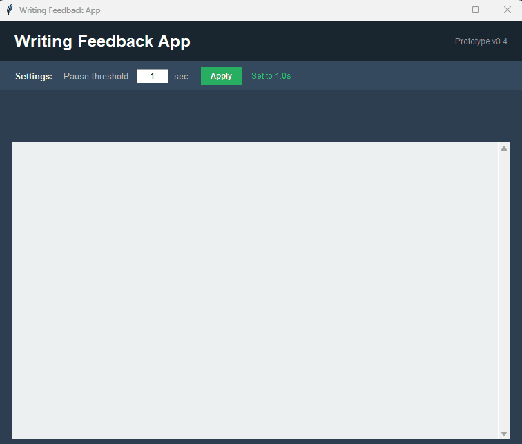

# Writing Feedback App

A desktop prototype that watches for pauses while you type, then identifies pause location using Systemic Functional Linguistics (SFL) based categories and gives feedback in real-time accordingly.

*Built on findings from my PhD at Lund University. 
Sayyad Mahernia, M. (2026). Pause for thought: Systemic Functional units and the dynamics of writing [Doctoral dissertation, Lund University]. Lund University Publications. https://lup.lub.lu.se/search/publication/f454544b-a7ed-4770-8e82-4c4abc110de1



---

## The idea

In my PhD project I found that pauses in writing aren't random. Their duration and placement track important structural points, with the longest pauses falling at sentence boundaries.

This app tests whether that signal is usable in real-time. When you stop typing for longer than a set threshold, it parses the text up to your cursor and reports what kind of boundary you paused at and tries to give appropriate feedback.

## What it shows

When a pause is detected, three things appear:

**An encouragement prompt** — a rotating nudge to keep going.

**Tier 1 — structural position.** Where the pause falls relative to clause structure:

| Label | Meaning |
|---|---|
| Clause boundary | Clause appears complete (ends in `.` `!` `?`) |
| Phrase boundary | End of a noun phrase, object, or adverbial |
| Pre-Theme | Clause not yet begun — no Subject or Finite written |
| Theme–Rheme boundary | Subject written, Process not yet |
| Within-Rheme | Clause in progress |
| Mid-word | Stopped partway through a word |

Each is colour-coded so the position is readable at a glance.

**Tier 2 — transitivity role.** What the last completed element was: Participant (Actor, Goal, Phenomenon, Attribute…), Process, Circumstance, Epithet, Deictic, and so on — mapped from spaCy dependency labels to SFL categories.

## Process type

Alongside the two tiers, every pause is also assigned the TRANSITIVITY process type of the clause being written — the *Process Expressed* dimension, kept separate from the functional role of the last element. It appears on the Tier 2 line and is written to its own CSV column:

| Type | Example |
|---|---|
| Material | *She climbed the mountain* |
| Mental | *I believe that*, *He laughed* |
| Relational | *He became a doctor*, *The soup tastes good* |
| Verbal | *The report says* |
| Existential | *There is a problem* |

Identifying and Attributive are combined under Relational. Behavioural processes are not a separate type; where they go is set by the `BEHAVIOURAL_AS` constant in `process_type.py`, currently Mental. Sessions coded under different settings are not comparable, so change it before collecting rather than after.

Classification is lexicon-based, so verbs that cross types (*have a car* vs *have a shower*) get their most frequent reading. Treat the output as first-pass automatic coding and check agreement against hand-coded data before relying on it.

Process type is computed independently of the boundary classification, so it is still recorded at pauses where Tier 1 and Tier 2 are blank — for example at a phrase boundary. This mirrors the coding scheme, where *Process Expressed* is a separate column from *Functional Context*.

## How it works

```
keystroke → reset timer → [threshold elapsed] → parse text up to cursor
  → classify boundary → two-tier SFL analysis → process type → display
```

**Boundary detection** works from spaCy dependency parsing for phrase boundaries (`pobj`, `dobj`, `attr`, noun-chunk endings).

**Mid-word detection** is the fiddly part. To tell "paused after a word" from "paused inside one," the app checks whether the final token is a real English word using `wordfreq` frequency thresholds with a curated whitelist for 1–3 character words, where frequency alone is unreliable.

**Process typing** clips the text back to the clause in progress before parsing, so the Process reported belongs to the clause being written rather than to an earlier sentence.

**Stats bar** tracks word count, pause count, and WPM. The WPM figure excludes time spent paused, so it reflects active writing speed rather than session length.

Everything is logged to `history.log` with timestamps and boundary classifications which makes the app also usable as a data-collection tool for further pause research.

**Session export.** Ending a session — the *End session & save* button, or closing the window — writes two files to `sessions/`: the final text, and a CSV of writing bursts with one row per pause.

| Column | Meaning |
|---|---|
| `burst` | text produced since the previous pause |
| `pause_ms` | length of the pause that followed it |
| `burst_chars`, `burst_ms` | size and duration of the burst |
| `pause_location` | boundary type the pause fell at |
| `sfl_tier1`, `sfl_tier2` | the two SFL labels above |
| `process_type` | process type of the clause being written |

`pause_ms` is the interval between the last keystroke of a burst and the first keystroke of the next, so a pause still open when the session ends is left empty rather than truncated. `burst` is net text: backspaces within a burst pop from it, and a burst spent revising earlier text comes out empty.

## Running it

```bash
pip install -r requirements.txt
python -m spacy download en_core_web_sm
python main.py
```

Requires Python 3.8+. Built with tkinter (bundled with Python), spaCy, and wordfreq.

The participant ID and pause threshold are set in the app. The 10s default suits live feedback; for collecting burst data a lower threshold (~2s) is more usual.

## Status

Prototype (v0.6). Working and usable, but English-only and untested against real writers. Natural next steps: a session summary view, and validation of the boundary classifier and process typing against hand-annotated data.